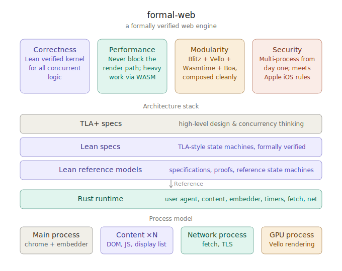

# formal-web

formal-web is a Rust browser prototype with explicit user-agent, event-loop, timer, fetch, content, and net components. The executable browser and its coordination logic live entirely in Rust, and the long-term verification direction is TLA+ trace checking over those Rust state transitions.

---



---

## The problem

Some of the hardest bugs in browsers are in the coordination. Navigation races, session history corruption, fetch ordering errors, and timer ordering mistakes are concurrency bugs.

## The approach

formal-web keeps navigation, session-history, timer, fetch, and event-loop coordination as explicit Rust state machines with direct links back to the relevant standards. The TLA+ models under `verification/tla_specs/` are the remaining formal artifacts in-tree, and a trace-based verification workflow for the Rust runtime is planned on top of those models.

---

## Four pillars

### Correctness

The most complicated concurrent algorithms live in explicit Rust worker threads and state machines. The implementation is documented against the HTML, Fetch, DOM, Streams, and Web IDL standards, with local copies of those standards checked into `web_standards/`.

### Performance

Perceived performance is about latency, not throughput. formal-web keeps the main render path unblocked, and heavy browser coordination work runs in dedicated threads or sidecars.

### Modularity

The engine composes best-in-class open components:

- **Blitz** — DOM and layout
- **Vello** — GPU-accelerated rendering
- **Wasmtime** — WebAssembly runtime
- **Boa** — JavaScript engine

The Blitz + Vello + anyrender pipeline is naturally composable, supporting advanced use cases like cross-process iframes and media elements with minimal coordination overhead. Anything beyond core web standards is implemented as an explicit Rust module instead of hidden runtime wiring.

### Security

The process model is designed to meet Apple's [architectural requirements](https://developer.apple.com/documentation/browserenginekit/designing-your-browser-architecture) for an independent web engine on iOS:

- **Content processes** (one per tab) — DOM, JavaScript, display-list production
- **Network process** — fetch, TLS
- **GPU process** — Vello rendering (currently still in the main process)
- **Main process** — browser chrome, embedder, and worker bootstrap

---

## The bet

Composable Rust modules plus protocol-level TLA+ verification is a tractable path to a correct, secure, and performant web engine.

## Requirements

- `rustup`
- Rust toolchain `1.92.0`: `rustup toolchain install 1.92.0`
- `python3`
- `curl`
- TLA+ Toolbox installed at `/Applications/TLA+ Toolbox.app` so verification can launch `/Applications/TLA+ Toolbox.app/Contents/Eclipse/tla2tools.jar`
- On macOS, Xcode and a current macOS SDK

## Commands

```bash
rustup run 1.92.0 cargo run --release
```

`cargo check` builds the Rust crates that make up the embedder, user agent, content sidecar process, and net sidecar process.

`cargo run --release` starts the embedder and user-agent thread, then launches the dedicated `formal-web-content` and `formal-web-net` sidecar executables on demand, then loads `artifacts/StartupExample.html`.

```bash
rustup run 1.92.0 cargo run --release -- --verify
```

`cargo run --release -- --verify` starts the verification monitor thread in the main process, shares its sender with local worker threads, sends that sender to the content and net sidecars as the first post-bootstrap IPC command, records NDJSON logs under a per-run directory in the system temp folder, validates those logs during shutdown with the local TLA+ Toolbox install, prints the result, removes the temporary verification directory afterward, and clears legacy repo-local trace directories such as `tla-traces/`, `states/`, `tla_specs/states/`, and `verification/tla_specs/states/` together with ignored TLC `.out` files under the spec roots.

```bash
./verification/verify-navigation.sh
```

`./verification/verify-navigation.sh` builds the release browser and sidecars, launches the headless WebDriver flow with `--verify`, clicks `a.article-link`, waits for `artifacts/navigated.html`, and confirms shutdown prints a successful navigation verification result.

```bash
rustup run 1.92.0 cargo run -- test-wpt formal/load-event-fires.html
```

`cargo run -- test-wpt` runs the current WPT runner. The parent process mounts `tests/formal/tests/` through the `/__formal__/` alias, starts a bundled `vendor/wpt/wpt serve` instance, and reuses one `formal-web webdriver` child and WebDriver session across the run in headless mode by default. The runner launches the browser child from the release build unless `--debug-build` is passed. Pass `--headed` when you want to watch the page.

The runner starts one `wpt serve` instance for the run, keeps one shared browser session for sequential test navigation, and uses `common/blank.html` between tests before loading the next test URL. If the browser session crashes, the runner recreates that session and retries the current test once while keeping the same `wpt serve` process alive. Before each run it also clears stale recorded `wpt serve` process IDs from previous interrupted runs. The runner collects `testharness.js` completion through WebDriver script execution with a rendered-summary fallback from `testharnessreport.js`.

For `.any.js` files, the runner currently serves the `.any.html` variant and executes the plain window form. Worker, shared-worker, and service-worker variants are still left out of the default runner selection.

The runner writes generated `wpt serve` config and injection files under `scratchpad/wpt-runner/runtime/` and removes them after each test. When machine-readable output is needed, point `--output` at a path under `scratchpad/wpt-runner/reports/`.

Without a path it uses both `tests/wpt/include.ini` and `tests/formal/include.ini`. With `--list` it prints the selected tests without launching the embedder. Explicit paths can point at the upstream WPT tree or at the local suite through the `formal/` prefix.

```bash
rustup run 1.92.0 cargo run -- validate-tla --logs /path/to/recorded/logs --json
```

`validate-tla` runs the verification package's manual validator through the root CLI. It is meant for focused diagnosis against an explicit recorded log directory. The validator scans `verification/tla_specs/` for known specs, reads `*.ndjson` from `--logs`, generates the companion `TraceData` module from the recorded log, runs TLC for each available trace spec in a temporary working directory, and removes that temporary TLC workspace afterward. `--only` is optional and meant for focused debugging.

On this machine TLC comes from the local TLA+ Toolbox installation rather than from this repository. The verifier launches the Toolbox jar against the trace spec with the same shape as:

```bash
java -jar "/Applications/TLA+ Toolbox.app/Contents/Eclipse/tla2tools.jar" -config verification/tla_specs/NavigationTrace.cfg verification/tla_specs/NavigationTrace.tla -workers 8
```

The built-in verification flow uses that external jar path by default, and `verification/verify-navigation.sh` exports the same jar path and worker count before it launches the browser.

## Verification direction

The TLA+ specifications live under `verification/tla_specs/`. Each tracer appends `LogEntry` records tagged with the spec name, and the verification monitor writes those NDJSON logs into a temporary per-run directory.

Validation does not run the base spec to generate a second trace and then compare two traces. The recorded NDJSON log is the observed execution trace. The validator converts that log into a generated `TraceData` module, loads the trace spec together with the base spec in TLC, and checks whether TLC accepts the recorded sequence.

A basic end-to-end verification pass should load `artifacts/StartupExample.html` through headless WebDriver, click `a.article-link`, and poll until the current URL reaches `artifacts/navigated.html`. For navigation-verification work, run that same flow with `--verify` enabled and confirm shutdown prints a successful verification result.